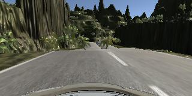
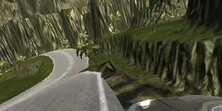
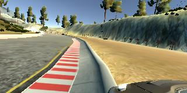
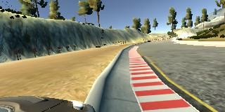

# **Behavioral Cloning of Car on Simulator**

The goals / steps of this project are the following:
* Use the simulator to collect data of good driving behavior
* Build, a convolution neural network in Keras that predicts steering angles from images
* Train and validate the model with a training and validation set
* Test that the model successfully drives around track one without leaving the road
* Summarize the results with a written report


[//]: # (Image References)

[image1]: ./examples/placeholder.png "Model Visualization"
[image2]: ./center.JPG "Model Visualization"
[image3]: ./left.jpg "Recovery Image"
[image4]: ./right.jpg "Recovery Image"
[image5]: ./cent1.jpg "Recovery Image"


## Rubric Points
### Here I will consider the [rubric points](https://review.udacity.com/#!/rubrics/432/view) individually and describe how I addressed each point in my implementation.  

---
### Files Submitted & Code Quality

#### 1. Submission includes all required files and can be used to run the simulator in autonomous mode

My project includes the following files:
* model.py containing the script to create and train the model
* drive.py for driving the car in autonomous mode
* model.h5 containing a trained convolution neural network 
* readme.md summarizing the results
* video.mp4 video recording of autonomously driving car from center camera
* [sdcnd.mp4](https://drive.google.com/file/d/0B5JhOt8s53ruODhjU0ZCR1RvdEk/view?usp=sharing) video recording of Self Driving Car while testing it.

#### 2. Submission includes functional code
Using the Udacity provided simulator and my drive.py file, the car can be driven autonomously around the track by executing 
```
python drive.py model.h5
```

#### 3. Submission code is usable and readable

The model.py file contains the code for training and saving the convolution neural network. The file shows the pipeline I used for training and validating the model, and it contains comments to explain how the code works.

### Model Architecture and Training Strategy

#### 1. An appropriate model architecture has been employed

My model's architecture is based [this paper by nvidia](<http://images.nvidia.com/content/tegra/automotive/images/2016/solutions/pdf/end-to-end-dl-using-px.pdf>). I have made some changes to the network for training my network.

My model is using the power of Convolution Networks:
```
model.add(Convolution2D(24, 5, 5, subsample=(2,2), activation='relu'))
model.add(Convolution2D(36, 5, 5, subsample=(2,2), activation='relu'))
model.add(Convolution2D(48, 5, 5, subsample=(2,2), activation='relu'))
model.add(Convolution2D(64, 3, 3, activation='relu'))
model.add(Convolution2D(88, 3, 3, activation='relu'))
```

I have used 5 Convolution layers with Rectified Linear Unit as activation function. After trying multiple combinations of filter's depth, width, height and strides, I decided to choose the above mentioned values.

I have cropped the images using keras [Cropping2D()](<https://keras.io/layers/convolutional/#cropping2d>), so as to capture only the required portion of image. This reduces the training time and enhances the results.

#### 2. Attempts to reduce overfitting in the model

I have taken a few steps to reduce the probability of over-fitting and build an efficient model:
- Normalization of Data using Keras Lambda().
- Augmenting data by flipping the images. This increased the training data by 3x
- Training on another track to help the model generalize better.
- Usage of Max-pooling Layer and Dropout in the network.


The model was trained and validated on different data sets to ensure that the model was not overfitting. The model was tested by running it through the simulator and ensuring that the vehicle could stay on the track.

#### 3. Model parameter tuning

The model used an adam optimizer, so the learning rate was not tuned manually. Other parameters like height weight and depth of filters along with number of layers, %age of data in dropout layer, Epochs value are tuned after trying numerous combinations.
I am using 1050Ti GPU(4GB), so batch size value as 64 worked perfectly for me. 

#### 4. Appropriate training data

Training has been done by driving the car:
- In the Center lane
- Recovering from Left & Right sides of the road
- Clockwise and Anticlockwise driving on the track
- Driving the car on a different track
- Capturing more data on turns

For details about how I created the training data, see the next section. 

### Model Architecture and Training Strategy
 
#### 1. Solution Design Approach

The strategy while designing the model was to create a complex enough model that can learn the behavior of our training data and drive the car autonomously on the simulator. 

My first step was to use a convolution neural network model similar to the Nvidia's architecture. I thought this model might be appropriate because it's also based on similar problem and it actually worked pretty well. 

First step was to build a training data. For this, I used the simulator provided by Udacity. I captured 90000+ images(center+left+right camera). The simulator creates a log file which includes left, center, right camera image, steering angle, speed etc. 

I decided to use all the images as my training features and steering angle as the output. This lead the model to solve a regression problem for predicting the steering angle.

Used the training data to train my CNN. 

The final step was to run the simulator to see how well the car was driving around track one. There were a few spots where the vehicle fell off the track and in water. To improve the driving behavior in these cases, I trained a bit extra on turns and added the dropout layer. 
This gave pretty good results(as per my expectation after 7th try). :wink:

At the end of the process, the vehicle is able to drive autonomously around the track without leaving the road.

#### 2. Final Model Architecture

The final model architecture consisted of a convolution neural network with the following layers and layer sizes:


#### 3. Creation of the Training Set & Training Process

To capture good driving behavior, I first recorded two laps on track one using center lane driving. Here is an example image of center lane driving:

![alt text][image2]

I then recorded the vehicle recovering from the left side and right sides of the road back to center so that the vehicle would learn to come back to the track:

![alt text][image3]
![alt text][image4]
![alt text][image5]

Then I repeated this process on track two in order to get more data points.





To augment the data sat, I also flipped images and angles thinking that this would generalize the model. For example, here is an image that has then been flipped:

 <-> 



After the collection process, I had 91,491 images captured by camera. I then preprocessed augmented the data by flipping images. This created thrice of those data i.e, 274,473 data points.


I finally randomly shuffled the data set and put 20% of the data into a validation set. 

I used this training data for training the model. The validation set helped determine if the model was over or under fitting. The ideal number of epochs was 3 as evidenced by viewing the losses. Even with 5 epochs it was fluctuating a bit. So, I reduced it to 3, so that the model's training'll take reasonable amount of tim. I used an adam optimizer so that manually training the learning rate wasn't necessary.


#### References:
- [End to End Learning for Self-Driving Cars - Nvidia](<http://images.nvidia.com/content/tegra/automotive/images/2016/solutions/pdf/end-to-end-dl-using-px.pdf>)
- [Deep Learning #3: More on CNNs & Handling Overfitting](https://medium.com/towards-data-science/deep-learning-3-more-on-cnns-handling-overfitting-2bd5d99abe5d)
- [Udacity Self Driving Car T1 content](<https://www.udacity.com/drive>)
- [Discussion Forum @Udacity](<https://discussions.udacity.com/>)


